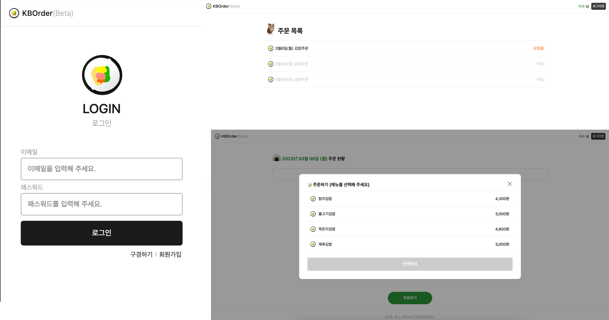

## 🍙 KB Order

### 🧑‍💻 프로젝트 개요.

- 점심시간 김밥주문 Order 취합 서비스 페이지.

### 👩‍🚀 구현 내용.

- Firebase 회원가입, 로그인.
- Firebase firestore 를 통한 Database 연동.

### 🏂 URL.

- [https://kb-order.vercel.app](https://kb-order.vercel.app)

### 🪬 Keyword.

- `React` `Nextjs` `Typescript` `Recoil` `chartjs` ~~`styled-components`~~ `emotion` `firebase` `firestore` `vercel`

### 📺 Owner

<table>
  <tr>
    <td align="center">
      <a href="https://github.com/fe-hyunsu">
      
       
      🎨 Design
       
      김현수
      </a>
    </td>
    <td align="center">
      <a href="https://github.com/fe-hyunsu">
      
       
      🖥 FE
       
      김현수
      </a>
    </td>
    <td align="center">
      <a href="https://firebase.google.com">
      
       
      📡 BE
       
      Firebase
      </a>
    </td>
  </tr>
</table>
